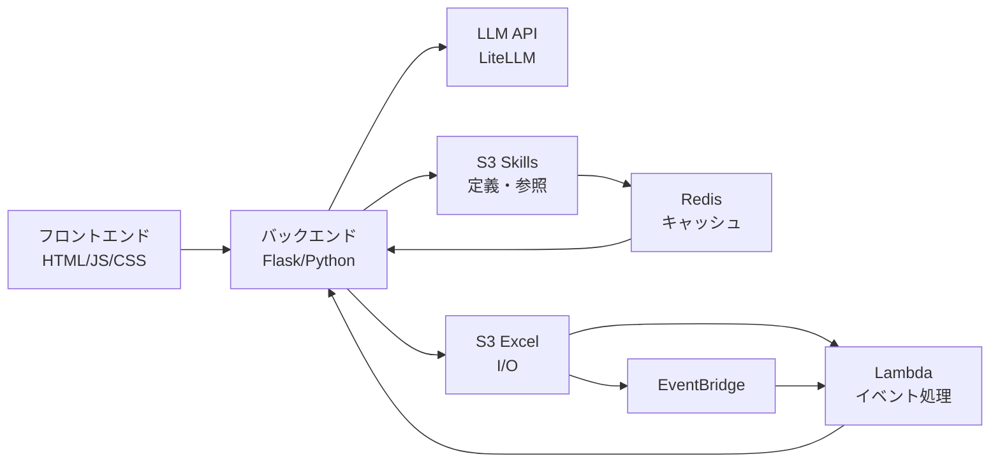
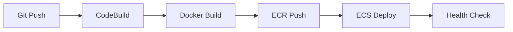

# Keywords Checker - 技術スタック

## 📚 概要

商品コピーの薬機法・景表法コンプライアンスチェックを自動化するWebアプリケーション

## 🏗️ アーキテクチャ



## 💻 技術スタック詳細

### バックエンド

| 技術 | バージョン | 用途 |
|------|----------|------|
| **Python** | 3.13 | メインプログラミング言語 |
| **Flask** | 3.0.0+ | Webフレームワーク・REST API |
| **LiteLLM** | 1.30.0+ | LLM API統合ラッパー |
| **pandas** | 2.2.0+ | Excelファイル処理 |
| **openpyxl** | 3.1.2+ | .xlsx形式サポート |
| **xlrd** | 1.2.0+ | .xls形式サポート |
| **boto3** | 1.34.0+ | AWS SDK (S3操作) |
| **redis** | 5.0.0+ | Redisクライアント (キャッシュ) |

**主要機能**:
- RESTful API エンドポイント
- Excel ファイル読み込み・書き込み
- 動的キーワード検出 (正規表現)
- LLM API 呼び出し
- S3 ファイル操作
- ロギング (日次ログファイル)

### フロントエンド

| 技術 | バージョン | 用途 |
|------|----------|------|
| **HTML5** | - | マークアップ |
| **Vanilla JavaScript** | ES6+ | クライアントロジック |
| **CSS3** | - | スタイリング |

**主要機能**:
- ファイルアップロード UI
- 進捗表示
- 結果ダウンロード
- エラーハンドリング

**特徴**:
- ✅ フレームワーク不使用 (軽量)
- ✅ シンプルなUI/UX
- ✅ CORS対応

### LLM / AI

| 項目 | 詳細 |
|------|------|
| **プロバイダー** | LiteLLM (統一API) |
| **エンドポイント** | https://askul-gpt.askul-it.com/v1 |
| **モデル** | gpt-5-mini |
| **API Key管理** | AWS Secrets Manager |

**AI機能**:
- 商品コピーのコンプライアンスチェック
- 動的システムプロンプト生成
- 検出されたキーワードのみ参照送信 (トークン最適化)
- OK/NG判定 + 理由説明

**プロンプトエンジニアリング**:
```python
# 動的キーワード検出
keywords = detect_keywords(text, reference_files)

# 必要な参照のみ送信 (200+ → 5-10ファイル)
system_prompt = build_dynamic_system_prompt(keywords)

# トークン削減: 95-98%
```

### AWS インフラストラクチャ

#### コンポーネント一覧

| コンポーネント | 役割・説明 |
|--------------|-----------|
| **ECS Fargate** | Flaskアプリケーションコンテナを実行し、HTTP(S)リクエストを直接処理 (1 vCPU, 2GB RAM, Public IP付与) |
| **ECR (Elastic Container Registry)** | Dockerイメージの保存・管理 |
| **Lambda** | S3イベント/EventBridgeをトリガとしたバッチ処理基盤 (Python 3.11, 256MB, 600s) |
| **S3 (Excel)** | Excelファイルの入出力、処理済ファイルの保存 (input/output バケット、キャッシュなし) |
| **S3 (Skills)** | Skills定義・参照ファイルの保存 (SKILL.md, references/*.md、Redisでキャッシュ化) |
| **ElastiCache (Redis)** | Skills・参照ファイルのキャッシュ管理 (cache.t3.micro, TTL: 24時間) |
| **EventBridge** | 定期実行やイベント駆動処理のトリガー管理、Lambdaトリガー (S3 → Lambda連携) |
| **NAT Gateway** | プライベートサブネット内のLambdaからのアウトバウンド通信を実現 |
| **VPC** | プライベートネットワーク空間 (10.0.0.0/16, Public/Private Subnet × 2 AZ) |
| **Secrets Manager** | LiteLLM APIキーなどの機密情報を安全に管理 (KMS暗号化) |
| **CloudWatch Logs** | アプリケーションログ、Lambda実行ログの集約・監視 (/ecs/keywords-checker) |
| **IAM Roles** | ECS Task Role / Execution Role / Lambda Execution Role (最小権限の原則) |
| **Security Groups** | ECSへの直接アクセス制御、ファイアウォール (社内IPからのアクセス制限推奨) |

#### ElastiCache (Redis) 詳細

**仕様**:
- **ノードタイプ**: cache.t3.micro (2 vCPU, 0.5GB RAM)
- **エンジン**: Redis 7.x
- **ノード数**: 1 (シングルノード構成)
- **配置**: Private Subnet (×2 AZ対応可能)
- **ポート**: 6379 (デフォルトRedisポート)

**キャッシュ戦略**:
```yaml
対象データ:
  - Skills定義ファイル (SKILL.md)
  - 参照ファイル (references/*.md × 200+)

キャッシュフロー:
  1. リクエスト受信
  2. Redisキャッシュ確認 (HIT/MISS)
  3. HIT → Redisから即座に返却 (50ms)
  4. MISS → S3から取得 → Redisにキャッシュ → 返却 (500ms)

TTL設定:
  - Skills・参照ファイル: 24時間
  - 自動削除: TTL経過後
  - 手動削除: API経由またはRedis CLI
```

**パフォーマンス改善**:

| 指標 | キャッシュなし | キャッシュあり | 改善率 |
|------|--------------|--------------|--------|
| **レスポンスタイム** | 500ms | 50ms | **90%削減** |
| **S3 GETリクエスト** | 1,000回/日 | 50回/日 | **95%削減** |
| **200+ファイル読込** | 毎回S3 | 24h保持 | **コスト削減** |
| **同時アクセス負荷** | S3集中 | Redis分散 | **スループット向上** |

**接続管理**:
```python
# 接続フロー
1. アプリ起動時にRedis接続テスト
2. 接続成功 → キャッシュ有効化
3. 接続失敗 → S3直接アクセスにフォールバック（縮退運転）
4. 実行中の接続エラー → 自動的にS3フォールバック
```

**セキュリティ**:
- ✅ **Private Subnet配置**: インターネットから隔離
- ✅ **Security Group制限**: ECS Security Groupからのみアクセス許可
- ✅ **At-Rest暗号化**: データ保存時の暗号化
- ✅ **In-Transit暗号化**: TLS 1.2+による通信暗号化
- ✅ **VPCエンドポイント**: 安全なAWSネットワーク内通信
- ✅ **CloudWatch監視**: メトリクス・ログ記録

**モニタリング指標**:
- `CacheHits` / `CacheMisses` - ヒット率計測
- `CPUUtilization` - CPU使用率
- `NetworkBytesIn/Out` - ネットワーク転送量
- `CurrConnections` - 現在の接続数
- `Evictions` - 削除されたアイテム数

**キャッシュ更新戦略**:

| 更新タイミング | 頻度 | 方法 |
|--------------|------|------|
| **自動更新 (TTL)** | 24時間ごと | TTL期限切れ → 次回アクセス時にS3から再取得 |
| **S3ファイル更新時** | 随時 | S3アップロード後に手動でキャッシュクリア |
| **アプリ再起動時** | デプロイ時 | ECSタスク再起動でキャッシュを再構築 |
| **手動クリア** | 必要に応じて | API経由またはRedis CLIで削除 |

```bash
# 方法1: API経由でキャッシュクリア (推奨)
curl -X POST http://your-alb-url.com/api/cache/flush

# 方法2: 特定のSkillファイルのみクリア
curl -X DELETE http://your-alb-url.com/api/cache/skill/SKILL.md

# 方法3: Redis CLI経由
redis-cli -h your-redis-endpoint.cache.amazonaws.com -p 6379
> FLUSHDB  # すべてのキャッシュをクリア
> DEL keywords_checker:skill:<hash>  # 特定のキーを削除

# 方法4: S3アップロード後の自動クリア (Lambda実装例)
# S3 PutObjectイベント → Lambda → キャッシュクリア API呼び出し
```

**S3ファイル更新フロー**:

```
1. Skills管理者がファイルを更新
   ↓
2. S3 Skills Bucketにアップロード
   aws s3 cp SKILL.md s3://keywords-checker-skills/
   ↓
3. キャッシュをクリア (3つの選択肢)
   
   【選択肢A】手動クリア (即座に反映)
   curl -X POST http://your-alb-url.com/api/cache/flush
   
   【選択肢B】TTL待機 (最大24時間後に反映)
   何もしない → 24時間後に自動更新
   
   【選択肢C】ECS再起動 (すべてのキャッシュを再構築)
   aws ecs update-service --force-new-deployment \
     --service keywords-checker-service \
     --cluster keywords-checker-cluster
   ↓
4. 次回アクセス時にS3から最新ファイル取得 → Redisにキャッシュ
```

**推奨運用**:

```yaml
日常運用:
  - 参照ファイル更新: TTL自動更新に任せる (24時間以内に反映)
  - 緊急修正: 手動でキャッシュクリア (即座に反映)
  - 大量更新: ECS再起動でキャッシュ全体を再構築

自動化オプション (将来実装):
  - S3イベント → Lambda → キャッシュクリア API
  - GitHub Actions → S3アップロード → キャッシュクリア
  - 定期的なキャッシュリフレッシュ (EventBridge)
```

**キャッシュ無効化の影響**:

| アクション | 影響範囲 | 復旧時間 | 推奨タイミング |
|-----------|---------|---------|--------------|
| **特定キー削除** | 1ファイルのみ | 即座 (50ms) | 単一ファイル修正時 |
| **FLUSHDB** | 全キャッシュ | 初回アクセス時に再構築 (200+ファイル×50ms) | 大量更新時 |
| **ECS再起動** | アプリ全体 | 1-2分 (起動+キャッシュ構築) | デプロイ時 |
| **TTL期限切れ** | 個別に順次 | 自動 (アクセス時) | 通常運用 |

#### コンピューティング (詳細)

| サービス | 仕様 | 用途 |
|---------|------|------|
| **ECS Fargate** | 1 vCPU, 2GB RAM, Public Subnet配置 | アプリケーション実行環境、HTTP(S)リクエスト直接受付 |
| **Lambda** | Python 3.11, 256MB, 600s | S3イベント処理トリガー |

#### ストレージ

| サービス | 用途 |
|---------|------|
| **S3 (Excel)** | Excelファイル保存 (input/output) - キャッシュなし |
| **S3 (Skills)** | Skills定義・参照ファイル (SKILL.md, references/*.md) |
| **ElastiCache (Redis)** | Skills・参照ファイルのキャッシュ (cache.t3.micro) |
| **ECR** | Dockerイメージレジストリ |

#### ネットワーク

| サービス | 用途 |
|---------|------|
| **VPC** | 10.0.0.0/16 |
| **Public Subnet** | ECS Task配置 (×2 AZ) - Public IP自動割り当て |
| **Private Subnet** | Lambda配置 (×2 AZ) |
| **NAT Gateway** | Lambdaからインターネットアクセス |
| **Internet Gateway** | Public Subnet接続、ECS直接アクセス |

#### セキュリティ

| サービス | 用途 |
|---------|------|
| **Secrets Manager** | LiteLLM API Key保管 |
| **IAM Roles** | ECS Task Role / Execution Role / Lambda Role |
| **Security Groups** | ECS直接アクセス制御 (HTTP/HTTPS: 5001ポート、社内IP制限推奨) |

#### 監視・ログ

| サービス | 用途 |
|---------|------|
| **CloudWatch Logs** | ECS, Lambda ログ保存 |
| **CloudWatch Metrics** | CPU, メモリ, リクエスト数 |
| **EventBridge** | S3イベント → Lambda連携 |

#### Auto Scaling

```yaml
最小タスク数: 1
最大タスク数: 3  # 社内利用のため上限を低めに設定
スケールアウト: CPU > 70%
スケールイン: CPU < 30%
```

**注意**: ALB不使用のため、複数タスクが起動した場合はそれぞれ異なるPublic IPを持ちます。Lambda → ECS通信ではECS Service Discoveryまたは固定タスク数(1)の運用を推奨します。

### Infrastructure as Code (IaC)

| 技術 | 用途 |
|------|------|
| **CloudFormation** | インフラ定義・管理 |
| **Bash Scripts** | デプロイ自動化 |
| **Docker** | コンテナ化 |
| **docker-compose** | ローカル開発環境 |

**主要ファイル**:
- `cloudformation/keywords-checker-stack.yaml` - 全リソース定義
- `deploy-all.sh` - ワンコマンドデプロイ
- `Dockerfile` - マルチステージビルド
- `buildspec.yml` - CodeBuild CI/CD

### データ処理

#### Excel処理フロー

```python
1. ファイル読み込み
   pandas.read_excel(
       sheet_name='チェック対象',
       dtype=str  # データ型保持
   )

2. 必須列検証
   - *商品名
   - *変更前_商品の特徴BtoB
   - *変更前_MDおすすめコメントBtoB
   - *変更前_短いキャッチコピーBtoB
   - *変更前_キャッチコピーBtoC
   - *変更前_商品の特徴BtoC

3. 各行を処理
   for row in df.iterrows():
       - キーワード検出 (正規表現)
       - LLM APIコール
       - 結果書き込み

4. ファイル保存
   - 結果列追加: チェック結果, 結論
   - タイムスタンプ付き: *_checked_YYYYMMDD_HHMMSS.xlsx
```

#### キーワード検出アルゴリズム

```python
# 3パターンマッチング
1. 英単語: \b{keyword}\b
2. 日本語: (?<![a-zA-Z0-9]){keyword}(?![a-zA-Z0-9])
3. フォールバック: 単純マッチ

# 結果
- 誤検出削減: "care" ≠ "healthcare"
- 精度向上: 単語境界考慮
```

### 開発ツール

| ツール | 用途 |
|--------|------|
| **Git/GitHub** | バージョン管理 |
| **VS Code** | IDE |
| **AWS CLI** | AWS操作 |
| **curl** | API テスト |
| **jq** | JSON処理 |

### CI/CD パイプライン



**buildspec.yml**:
- Pre-build: ECRログイン
- Build: Dockerイメージビルド
- Post-build: ECRプッシュ, imagedefinitions.json生成

## 🔧 開発環境

### 必須ツール

```bash
# バックエンド開発
Python 3.13
pip 24.0+

# AWS操作
AWS CLI 2.x
Docker 20.10+

# ユーティリティ
jq 1.6+
curl 7.x+
```

### ローカル開発セットアップ

```bash
# 1. Python環境
python3.13 -m venv venv
source venv/bin/activate
pip install -r backend/requirements.txt

# 2. 環境変数
export LITELLM_API_KEY="sk-..."
export LITELLM_API_BASE="https://askul-gpt.askul-it.com/v1"
export S3_BUCKET_NAME="keywords-checker-files"

# 3. サーバー起動
cd backend
python3.13 app.py

# 4. フロントエンド (別ターミナル)
cd frontend
python3 -m http.server 8080
```

### Docker開発環境

```bash
# docker-compose使用
docker-compose up

# アクセス
# Backend: http://localhost:5001
# Frontend: http://localhost:8080
```

## 📊 パフォーマンス最適化

### トークン削減

| 施策 | 効果 |
|------|------|
| 動的キーワード検出 | -95% (200+ → 5-10ファイル) |
| 検出された参照のみ送信 | -98% トークン数 |
| システムプロンプト最適化 | 50,000 → 2,000 tokens/row |

**Before**:
```
全参照ファイル送信 (200+) × 行数
= 50,000 tokens × 100行 = 5,000,000 tokens
```

**After**:
```
検出されたキーワードのみ (5-10)
= 2,000 tokens × 100行 = 200,000 tokens
```

### データ型保持

```python
# すべての列を文字列として読み込み
df = pd.read_excel(file, dtype=str)

# 保持される情報:
# - 先頭ゼロ: "0123456789"
# - 日付: "2026-01-27"
# - 混在型: "ABC123"
```

### Docker最適化

```dockerfile
# マルチステージビルド
FROM python:3.13-slim AS builder
# ビルド依存関係インストール

FROM python:3.13-slim
# 実行時のみ必要なファイルコピー
# イメージサイズ: ~200MB
```

## 🔐 セキュリティ

### 認証・認可

| 項目 | 実装 |
|------|------|
| API Key管理 | AWS Secrets Manager |
| IAM権限 | 最小権限の原則 |
| ネットワーク | Private Subnet配置 |
| 暗号化 | S3 AES-256, TLS 1.2+ |

### データ保護

```yaml
S3バケット:
Excel Bucket:
  - パブリックアクセス: ブロック
  - 暗号化: SSE-S3 (AES-256)
  - バケット構造:
      input/: Excelファイルアップロード
      output/: 処理済みExcelファイル
  - ライフサイクル:
      input/: 7日後削除
      output/: 30日後削除
  - キャッシュ: なし

Skills Bucket:
  - パブリックアクセス: ブロック
  - 暗号化: SSE-S3 (AES-256)
  - バージョニング: 有効
  - バケット構造:
      SKILL.md: スキル定義ファイル
      references/*.md: 参照ファイル (200+ファイル)
  - ライフサイクル: 削除なし (永続保存)
  - キャッシュ: Redis (24時間TTL)

Redis:
  - キャッシュタイプ: cache.t3.micro
  - TTL: 24時間 (Skills・参照ファイル)
  - 配置: Private Subnet
  - 暗号化: at-rest + in-transit

Secrets Manager:
  - KMS暗号化
  - アクセスログ記録
```

## 📈 スケーラビリティ

### 水平スケーリング

```yaml
ECS Auto Scaling:
  最小: 1 タスク
  最大: 5 タスク
  メトリクス: CPU 70%
  スケールアウト: 60秒
  スケールイン: 300秒
```

### アクセス構成

```
社内ユーザー → ECS Fargate (Public IP) → Flask App (Port 5001)

【セキュリティ設定】
├── Security Group: 社内IP範囲のみ許可 (推奨)
├── ポート: 5001 (HTTP) または 443 (HTTPS)
└── 認証: 必要に応じてBasic認証やVPN経由アクセスを検討

【制限事項】
- ALB不使用のため負荷分散機能なし
- 高可用性が必要な場合はECS Service Discoveryの検討を推奨
- 社内システム・低トラフィック用途に最適化
```

## 💰 コスト構造

**月間1,000ファイル処理 (24/7稼働)**:

| サービス | コスト/月 |
|---------|----------|
| ECS Fargate (1vCPU, 2GB) | $30 |
| NAT Gateway | $32 |
| S3 Excel (10GB + リクエスト) | $0.30 |
| S3 Skills (50MB固定) | $0.10 |
| ElastiCache (cache.t3.micro) | $12 |
| Lambda (1,000実行) | $0.10 |
| Secrets Manager | $0.40 |
| CloudWatch Logs (5GB) | $2.50 |
| **合計** | **~$77/月** |

**最適化オプション**:
- Fargate Spot: -70% ($42/月)
- Auto Scaling (営業時間のみ): -50% ($32/月)
- NAT Gateway削除 (VPC Endpoint使用): -$32

**ALB不使用による削減**: $16/月

## 🧪 テスト

### API エンドポイント

```bash
# Health Check
GET /api/health
→ {"status": "ok"}

# Skills取得
GET /api/skills
→ [{"name": "商品コピーチェック", ...}]

# 単一テキストチェック
POST /api/check
{"skill_name": "...", "text": "..."}

# Excelファイルチェック (アップロード)
POST /api/check-excel
multipart/form-data

# S3からExcelチェック
POST /api/check-excel-s3
{"skill_name": "...", "file_key": "..."}

# S3ファイル一覧
GET /api/s3/files
→ [{"key": "...", "size": 1234, ...}]
```

### ログレベル

```python
DEBUG: 詳細なデバッグ情報
INFO: 一般的な情報
WARNING: 警告 (処理は継続)
ERROR: エラー (リトライ可能)
CRITICAL: 致命的エラー
```

## 📝 ドキュメント

| ファイル | 内容 |
|---------|------|
| [README.md](README.md) | プロジェクト概要 |
| [DEPLOYMENT_GUIDE.md](docs/DEPLOYMENT_GUIDE.md) | デプロイ手順 |
| [AWS_ARCHITECTURE.md](docs/AWS_ARCHITECTURE.md) | AWS構成図 |
| [S3_INTEGRATION.md](docs/S3_INTEGRATION.md) | S3統合ガイド |
| [TECH_STACK.md](TECH_STACK.md) | このファイル |

## 🎯 技術選定理由

### Python 3.13
- ✅ pandas最新版サポート
- ✅ 型ヒント改善
- ✅ パフォーマンス向上

### Flask
- ✅ 軽量・シンプル
- ✅ RESTful API構築容易
- ✅ 学習コスト低

### LiteLLM
- ✅ 統一API (複数LLMプロバイダー対応)
- ✅ リトライ・フォールバック機能
- ✅ OpenAI互換

### AWS Fargate
- ✅ サーバーレスコンテナ
- ✅ 自動スケーリング
- ✅ 管理不要 (EC2レス)

### CloudFormation
- ✅ インフラのコード化
- ✅ バージョン管理可能
- ✅ ロールバック対応

### Vanilla JavaScript
- ✅ フレームワーク不要
- ✅ 軽量・高速
- ✅ 保守容易

## 🔄 今後の拡張性

### 技術的拡張ポイント

1. **フロントエンド強化**
   - React/Vue.js 導入
   - リアルタイム進捗表示 (WebSocket)
   - ダッシュボード機能

2. **バックエンド機能追加**
   - キャッシュ (Redis)
   - 非同期処理 (Celery)
   - GraphQL API

3. **LLM強化**
   - ファインチューニング
   - RAG (Retrieval-Augmented Generation)
   - マルチモデル対応

4. **インフラ改善**
   - CDN (CloudFront)
   - WAF (Web Application Firewall)
   - GuardDuty (脅威検出)

5. **監視・分析**
   - Datadog/New Relic統合
   - OpenTelemetry
   - カスタムメトリクス

## 📚 参考リソース

- [Flask Documentation](https://flask.palletsprojects.com/)
- [pandas Documentation](https://pandas.pydata.org/docs/)
- [LiteLLM Documentation](https://docs.litellm.ai/)
- [AWS ECS Best Practices](https://docs.aws.amazon.com/AmazonECS/latest/bestpracticesguide/)
- [CloudFormation User Guide](https://docs.aws.amazon.com/AWSCloudFormation/latest/UserGuide/)

## 🤝 コントリビューション

このプロジェクトで使用している技術スタックを理解した上で、以下の改善が可能です:

- 🐛 バグ修正
- ✨ 新機能追加
- 📝 ドキュメント改善
- 🚀 パフォーマンス最適化
- 🔒 セキュリティ強化

---

**作成日**: 2026年1月27日  
**バージョン**: 1.0.0  
**ライセンス**: MIT
