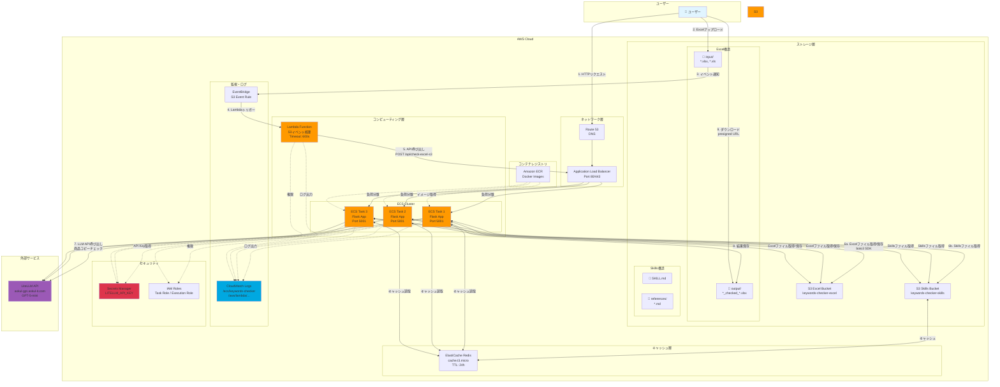
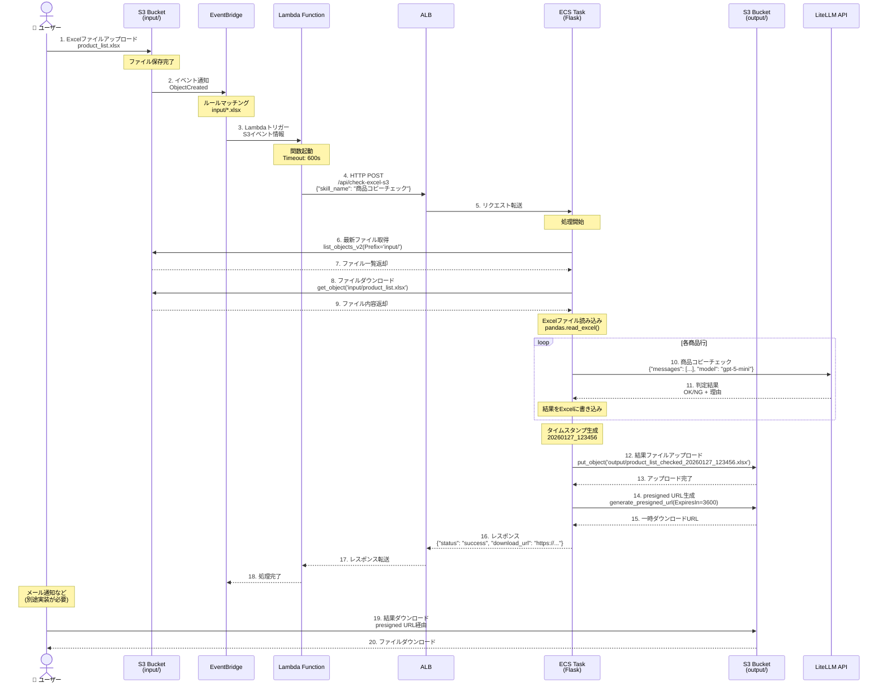
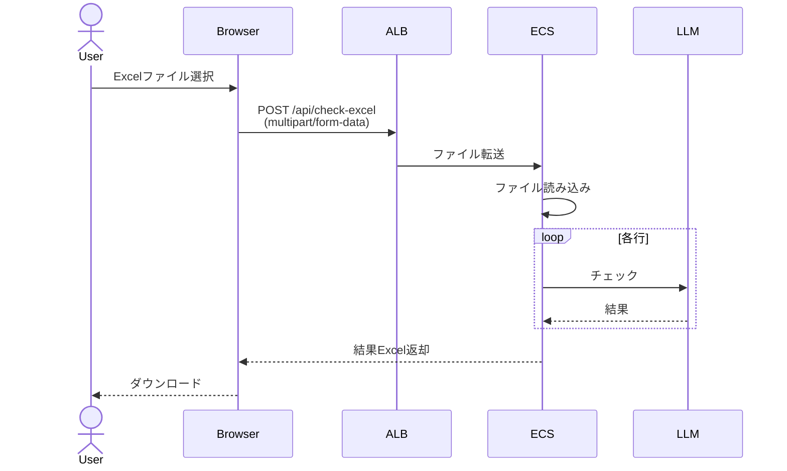
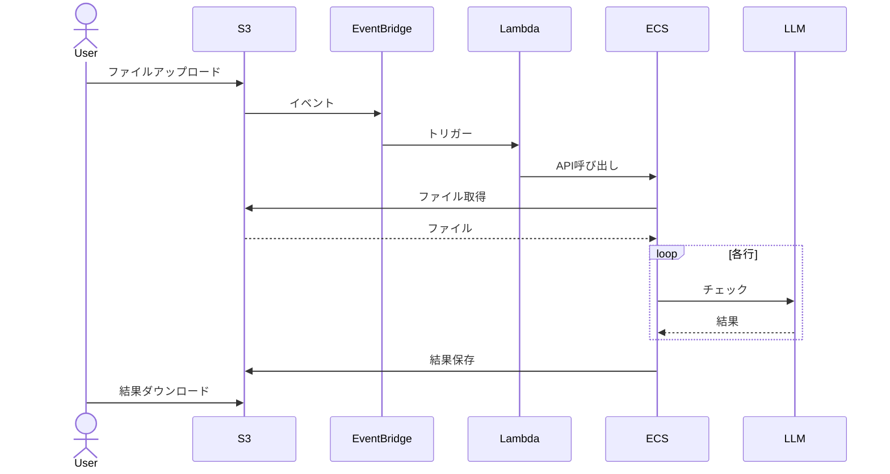
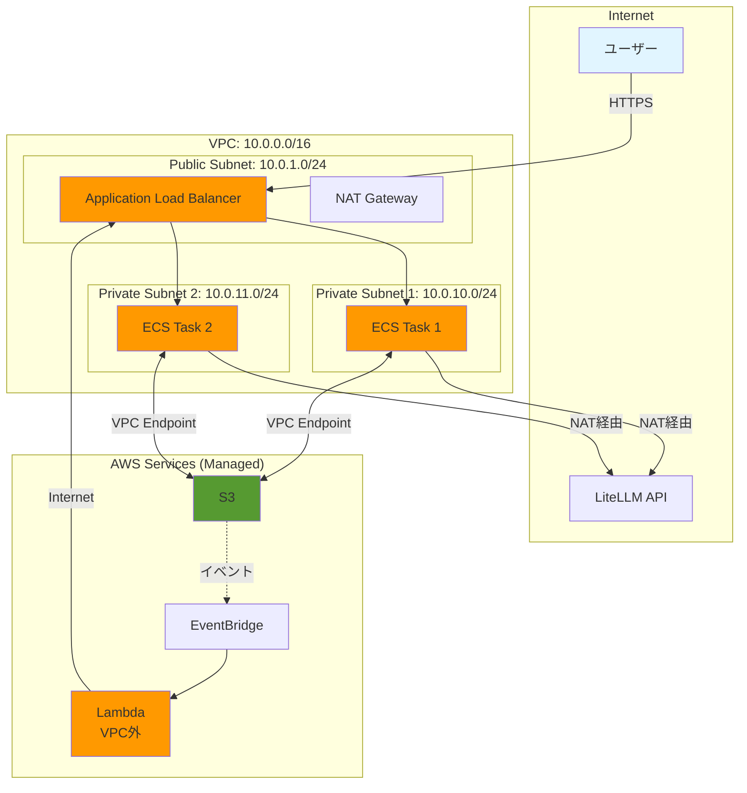
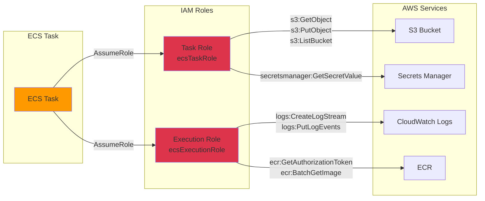
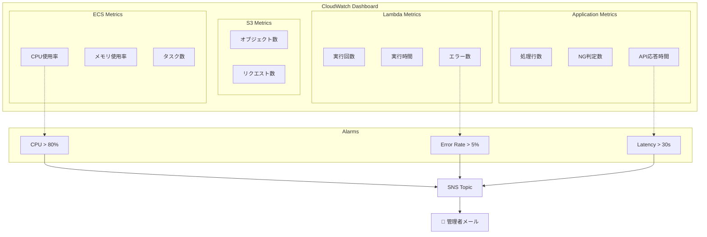

# AWS構成図 - Keywords Checker

## 全体アーキテクチャ



## シーケンス図: S3自動処理フロー



## コンポーネント詳細

### 1. ECS (Elastic Container Service)

**役割**: メインアプリケーションの実行環境

```
┌─────────────────────────────────────┐
│        ECS Fargate Task             │
├─────────────────────────────────────┤
│  Flask App (Port 5001)              │
│  ├── /api/health                    │
│  ├── /api/skills                    │
│  ├── /api/check                     │
│  ├── /api/check-excel               │
│  ├── /api/check-excel-s3  ⭐        │
│  └── /api/s3/files        ⭐        │
│                                     │
│  S3Manager (boto3)                  │
│  ├── get_latest_excel_file()        │
│  ├── upload_result_file()           │
│  └── list_input_files()             │
└─────────────────────────────────────┘
```

**リソース**:
- CPU: 1024 (1 vCPU)
- Memory: 2048 MB (2 GB)
- Auto Scaling: 1〜5タスク
- Health Check: GET /api/health

**環境変数**:
- `LITELLM_API_KEY`: Secrets Managerから取得
- `S3_BUCKET_NAME`: keywords-checker-files

### 2. Lambda Function

**役割**: S3イベントをトリガーとしてECS APIを呼び出す

```python
def lambda_handler(event, context):
    # S3イベントを検出
    # ↓
    # ECS APIを呼び出し
    response = requests.post(
        f"{API_ENDPOINT}/api/check-excel-s3",
        json={"skill_name": "商品コピーチェック"}
    )
    # ↓
    # 完了
```

**設定**:
- Runtime: Python 3.11
- Memory: 256 MB
- Timeout: 600秒 (10分)
- Environment: `API_ENDPOINT=http://your-alb-url.com`

**重要**: Lambdaはファイルを扱わない！APIを叩くだけ

### 3. S3 Bucket

**構造**:
```
keywords-checker-files/
├── input/                    ← ユーザーがアップロード
│   ├── product_list.xlsx
│   └── product_list_2.xlsx
│
└── output/                   ← ECSが保存
    ├── product_list_checked_20260127_123456.xlsx
    └── product_list_2_checked_20260127_140000.xlsx
```

**イベント通知**:
- EventBridge有効化
- ObjectCreated イベント
- Prefix: `input/`
- Suffix: `.xlsx`, `.xls`, `.xlsm`

### 4. EventBridge

**ルール設定**:
```json
{
  "source": ["aws.s3"],
  "detail-type": ["Object Created"],
  "detail": {
    "bucket": {
      "name": ["keywords-checker-files"]
    },
    "object": {
      "key": [{"prefix": "input/"}]
    }
  }
}
```

**ターゲット**: Lambda Function

## データフロー比較

### パターンA: 手動処理 (Web UI経由)



### パターンB: S3自動処理 (今回実装)



## ネットワーク構成



## IAM権限構成



## コスト最適化

### Lambda vs ECS直接実行

| 方式 | メリット | デメリット | コスト |
|------|---------|-----------|--------|
| **Lambda + ECS** | - イベント駆動<br/>- 自動スケール | - 2つのサービス<br/>- Lambda課金 | $0.34/月 + ECS |
| **ECS直接** | - シンプル<br/>- 管理容易 | - ポーリング必要<br/>- 常時実行 | ECSのみ |

**推奨**: Lambda使用（月間1000ファイル以下なら無料枠内）

### Auto Scaling設定

```json
{
  "TargetTrackingScaling": {
    "TargetValue": 70.0,
    "PredefinedMetric": "ECSServiceAverageCPUUtilization",
    "ScaleOutCooldown": 60,
    "ScaleInCooldown": 300
  },
  "MinCapacity": 1,
  "MaxCapacity": 5
}
```

## モニタリングダッシュボード



## セキュリティベストプラクティス

### 1. 最小権限の原則

```json
{
  "Version": "2012-10-17",
  "Statement": [
    {
      "Effect": "Allow",
      "Action": [
        "s3:GetObject",
        "s3:ListBucket"
      ],
      "Resource": [
        "arn:aws:s3:::keywords-checker-files/input/*"
      ]
    },
    {
      "Effect": "Allow",
      "Action": [
        "s3:PutObject"
      ],
      "Resource": [
        "arn:aws:s3:::keywords-checker-files/output/*"
      ]
    }
  ]
}
```

### 2. 暗号化

- **S3**: AES-256 (SSE-S3)
- **Secrets Manager**: KMS暗号化
- **ALB**: TLS 1.2以上
- **VPC**: VPC Endpointでプライベート通信

### 3. ネットワーク分離

- ECS: Private Subnetに配置
- ALB: Public Subnetに配置
- Lambda: VPC外 (必要に応じてVPC内も可)
- S3: VPC Endpoint経由でアクセス

## トラブルシューティング

### Lambda → ECS接続エラー

```bash
# セキュリティグループ確認
aws ec2 describe-security-groups --group-ids sg-xxxxx

# ALBリスナー確認
aws elbv2 describe-listeners --load-balancer-arn arn:aws:elasticloadbalancing:...
```

### S3アクセス拒否

```bash
# IAM Policy確認
aws iam get-role-policy --role-name ecsTaskRole --policy-name S3Access

# S3バケットポリシー確認
aws s3api get-bucket-policy --bucket keywords-checker-files
```

### Lambda タイムアウト

```bash
# Lambda設定確認
aws lambda get-function-configuration --function-name keywords-checker-s3-processor

# CloudWatch Logsで処理時間確認
aws logs tail /aws/lambda/keywords-checker-s3-processor --since 1h
```

## まとめ

### 🎯 重要ポイント

1. **Lambdaの役割**
   - ファイルを扱わない
   - ECS APIを呼び出すだけ
   - イベント駆動のトリガー

2. **ECSの役割**
   - 実際の処理を実行
   - S3から直接ファイル取得
   - LLM APIを呼び出し
   - 結果をS3に保存

3. **S3の役割**
   - ファイルストレージ
   - イベント発火
   - presigned URLで配信

### 📊 処理フロー

```
ユーザー → S3 → EventBridge → Lambda → ECS API
                                           ↓
                              ECS ←→ S3 (ファイル取得)
                               ↓
                              LLM API (チェック)
                               ↓
                              S3 (結果保存)
                               ↓
                             ユーザー (ダウンロード)
```
