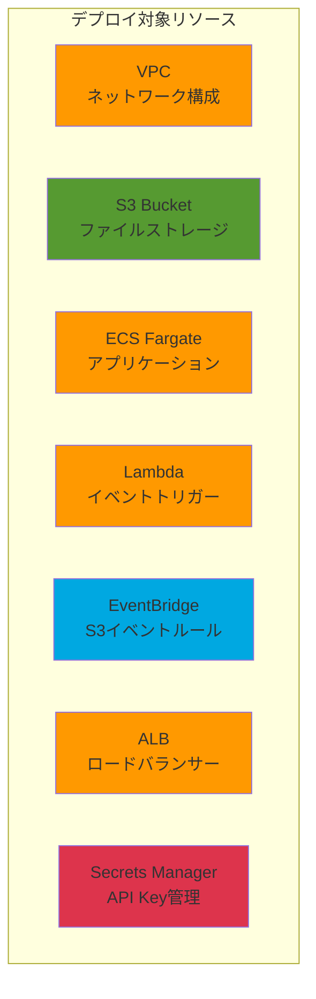

# デプロイガイド - Keywords Checker

## 概要

このアプリケーションは**3つの方法**でデプロイできます:

1. **🚀 ワンコマンドデプロイ** - CloudFormation (推奨)
2. **📦 個別デプロイ** - ECS、Lambda、EventBridgeを別々に
3. **🛠️ 手動デプロイ** - AWSコンソールから

## デプロイ構成



---

## 方法1: ワンコマンドデプロイ (推奨) 🚀

### 前提条件

```bash
# 必要なツール
- AWS CLI (最新版)
- Docker
- jq (JSON処理用)

# インストール確認
aws --version
docker --version
jq --version
```

### デプロイ手順

```bash
# 1. リポジトリに移動
cd /path/to/keywords-checker

# 2. デプロイスクリプト実行
./deploy-all.sh
```

スクリプトが自動的に以下を実行します:

1. ✅ AWS認証情報確認
2. ✅ LiteLLM API Key入力
3. ✅ ECRリポジトリ作成
4. ✅ Dockerイメージビルド & プッシュ
5. ✅ CloudFormationスタックデプロイ
   - VPC & ネットワーク
   - S3バケット
   - ECS Cluster & Service
   - Lambda Function
   - EventBridge Rule
   - ALB
   - Secrets Manager
   - IAM Roles
6. ✅ デプロイ結果表示

**所要時間**: 約10〜15分

### デプロイ後の確認

```bash
# Health Check
curl http://<ALB-URL>/api/health

# スタック情報確認
aws cloudformation describe-stacks \
  --stack-name keywords-checker-stack \
  --region ap-northeast-1

# S3バケット確認
aws s3 ls | grep keywords-checker
```

---

## 方法2: 個別デプロイ 📦

各コンポーネントを個別にデプロイします。

### 2.1 ECSデプロイ

```bash
# 既存のdeploy.shを使用
./deploy.sh

# 内容:
# - ECRリポジトリ作成
# - Dockerイメージビルド & プッシュ
# - ECS Task Definition更新
# - ECS Service更新
```

### 2.2 Lambdaデプロイ

```bash
# Lambdaパッケージ作成
cd lambda
zip -r s3_processor_lambda.zip s3_processor_lambda.py

# Lambda関数作成
aws lambda create-function \
  --function-name keywords-checker-s3-processor \
  --runtime python3.11 \
  --role arn:aws:iam::${AWS_ACCOUNT_ID}:role/lambda-execution-role \
  --handler s3_processor_lambda.lambda_handler \
  --zip-file fileb://s3_processor_lambda.zip \
  --timeout 600 \
  --memory-size 256 \
  --environment Variables="{API_ENDPOINT=http://<ALB-URL>}"

# または更新
aws lambda update-function-code \
  --function-name keywords-checker-s3-processor \
  --zip-file fileb://s3_processor_lambda.zip
```

### 2.3 EventBridge設定

```bash
# S3バケットのEventBridge有効化
aws s3api put-bucket-notification-configuration \
  --bucket keywords-checker-files \
  --notification-configuration '{
    "EventBridgeConfiguration": {}
  }'

# EventBridge Ruleの作成
aws events put-rule \
  --name keywords-checker-s3-upload \
  --event-pattern '{
    "source": ["aws.s3"],
    "detail-type": ["Object Created"],
    "detail": {
      "bucket": {
        "name": ["keywords-checker-files"]
      },
      "object": {
        "key": [{"prefix": "input/"}]
      }
    }
  }'

# Lambdaをターゲットに設定
aws events put-targets \
  --rule keywords-checker-s3-upload \
  --targets "Id"="1","Arn"="arn:aws:lambda:ap-northeast-1:${AWS_ACCOUNT_ID}:function:keywords-checker-s3-processor"

# Lambda実行権限付与
aws lambda add-permission \
  --function-name keywords-checker-s3-processor \
  --statement-id AllowEventBridgeInvoke \
  --action lambda:InvokeFunction \
  --principal events.amazonaws.com \
  --source-arn arn:aws:events:ap-northeast-1:${AWS_ACCOUNT_ID}:rule/keywords-checker-s3-upload
```

---

## 方法3: 手動デプロイ (AWSコンソール) 🛠️

### 3.1 VPC & ネットワーク

1. **VPC作成**
   - CIDR: `10.0.0.0/16`
   - DNS解決: 有効

2. **サブネット作成**
   - Public Subnet 1: `10.0.1.0/24` (AZ: ap-northeast-1a)
   - Public Subnet 2: `10.0.2.0/24` (AZ: ap-northeast-1c)
   - Private Subnet 1: `10.0.10.0/24` (AZ: ap-northeast-1a)
   - Private Subnet 2: `10.0.11.0/24` (AZ: ap-northeast-1c)

3. **Internet Gateway**
   - 作成してVPCにアタッチ

4. **NAT Gateway**
   - Public Subnet 1に作成
   - Elastic IP割り当て

5. **Route Tables**
   - Public: `0.0.0.0/0` → Internet Gateway
   - Private: `0.0.0.0/0` → NAT Gateway

### 3.2 S3バケット

1. **バケット作成**
   - 名前: `keywords-checker-files-<account-id>`
   - リージョン: ap-northeast-1
   - 暗号化: AES-256

2. **フォルダ作成**
   - `input/`
   - `output/`

3. **EventBridge有効化**
   - プロパティ → イベント通知 → EventBridge有効化

4. **ライフサイクルポリシー**
   ```json
   {
     "Rules": [
       {
         "Id": "DeleteOldOutputFiles",
         "Status": "Enabled",
         "Prefix": "output/",
         "Expiration": {"Days": 30}
       },
       {
         "Id": "DeleteOldInputFiles",
         "Status": "Enabled",
         "Prefix": "input/",
         "Expiration": {"Days": 7}
       }
     ]
   }
   ```

### 3.3 Secrets Manager

1. **シークレット作成**
   - 名前: `keywords-checker/litellm-api-key`
   - タイプ: その他のタイプのシークレット
   - キー/値:
     ```json
     {
       "api_key": "sk-xxxxx",
       "api_base": "https://askul-gpt.askul-it.com/v1"
     }
     ```

### 3.4 IAM Roles

#### ECS Task Execution Role

```json
{
  "Version": "2012-10-17",
  "Statement": [
    {
      "Effect": "Allow",
      "Action": [
        "ecr:GetAuthorizationToken",
        "ecr:BatchCheckLayerAvailability",
        "ecr:GetDownloadUrlForLayer",
        "ecr:BatchGetImage",
        "logs:CreateLogStream",
        "logs:PutLogEvents",
        "secretsmanager:GetSecretValue"
      ],
      "Resource": "*"
    }
  ]
}
```

#### ECS Task Role

```json
{
  "Version": "2012-10-17",
  "Statement": [
    {
      "Effect": "Allow",
      "Action": [
        "s3:GetObject",
        "s3:ListBucket"
      ],
      "Resource": [
        "arn:aws:s3:::keywords-checker-files-*",
        "arn:aws:s3:::keywords-checker-files-*/input/*"
      ]
    },
    {
      "Effect": "Allow",
      "Action": "s3:PutObject",
      "Resource": "arn:aws:s3:::keywords-checker-files-*/output/*"
    }
  ]
}
```

#### Lambda Execution Role

```json
{
  "Version": "2012-10-17",
  "Statement": [
    {
      "Effect": "Allow",
      "Action": [
        "logs:CreateLogGroup",
        "logs:CreateLogStream",
        "logs:PutLogEvents"
      ],
      "Resource": "arn:aws:logs:*:*:*"
    },
    {
      "Effect": "Allow",
      "Action": [
        "s3:GetObject",
        "s3:ListBucket"
      ],
      "Resource": [
        "arn:aws:s3:::keywords-checker-files-*",
        "arn:aws:s3:::keywords-checker-files-*/*"
      ]
    }
  ]
}
```

### 3.5 ECR & Docker

```bash
# ECRリポジトリ作成
aws ecr create-repository \
  --repository-name keywords-checker \
  --region ap-northeast-1

# Dockerイメージビルド & プッシュ
$(aws ecr get-login --no-include-email --region ap-northeast-1)
docker build -t keywords-checker:latest .
docker tag keywords-checker:latest <account-id>.dkr.ecr.ap-northeast-1.amazonaws.com/keywords-checker:latest
docker push <account-id>.dkr.ecr.ap-northeast-1.amazonaws.com/keywords-checker:latest
```

### 3.6 ALB

1. **セキュリティグループ作成**
   - 名前: `keywords-checker-alb-sg`
   - インバウンド:
     - HTTP (80) from 0.0.0.0/0
     - HTTPS (443) from 0.0.0.0/0

2. **ALB作成**
   - タイプ: Application Load Balancer
   - スキーム: internet-facing
   - サブネット: Public Subnet 1 & 2

3. **ターゲットグループ作成**
   - タイプ: IP
   - プロトコル: HTTP
   - ポート: 5001
   - ヘルスチェック: `/api/health`

4. **リスナー追加**
   - プロトコル: HTTP
   - ポート: 80
   - デフォルトアクション: ターゲットグループに転送

### 3.7 ECS

1. **ECS Cluster作成**
   - 名前: `keywords-checker-cluster`
   - タイプ: Fargate

2. **Task Definition作成**
   - ファミリー: `keywords-checker-task`
   - CPU: 1024 (1 vCPU)
   - メモリ: 2048 MB
   - コンテナ定義:
     ```json
     {
       "name": "keywords-checker-container",
       "image": "<ECR-URI>:latest",
       "cpu": 1024,
       "memory": 2048,
       "portMappings": [
         {
           "containerPort": 5001,
           "protocol": "tcp"
         }
       ],
       "environment": [
         {"name": "S3_BUCKET_NAME", "value": "keywords-checker-files-<account-id>"}
       ],
       "secrets": [
         {
           "name": "LITELLM_API_KEY",
           "valueFrom": "arn:aws:secretsmanager:ap-northeast-1:<account-id>:secret:keywords-checker/litellm-api-key:api_key::"
         }
       ],
       "logConfiguration": {
         "logDriver": "awslogs",
         "options": {
           "awslogs-group": "/ecs/keywords-checker",
           "awslogs-region": "ap-northeast-1",
           "awslogs-stream-prefix": "ecs"
         }
       },
       "healthCheck": {
         "command": ["CMD-SHELL", "curl -f http://localhost:5001/api/health || exit 1"],
         "interval": 30,
         "timeout": 5,
         "retries": 3
       }
     }
     ```

3. **ECS Service作成**
   - 起動タイプ: Fargate
   - タスク数: 1
   - VPC: keywords-checker-vpc
   - サブネット: Private Subnet 1 & 2
   - ロードバランサー: ALB
   - ターゲットグループ: keywords-checker-tg

4. **Auto Scaling設定**
   - 最小: 1
   - 最大: 5
   - メトリクス: CPU 70%

### 3.8 Lambda

1. **関数作成**
   - 名前: `keywords-checker-s3-processor`
   - ランタイム: Python 3.11
   - メモリ: 256 MB
   - タイムアウト: 600秒
   - 環境変数:
     - `API_ENDPOINT`: `http://<ALB-DNS-Name>`

2. **コードアップロード**
   - `lambda/s3_processor_lambda.py` をzipして アップロード

### 3.9 EventBridge

1. **ルール作成**
   - 名前: `keywords-checker-s3-upload`
   - イベントパターン:
     ```json
     {
       "source": ["aws.s3"],
       "detail-type": ["Object Created"],
       "detail": {
         "bucket": {
           "name": ["keywords-checker-files-<account-id>"]
         },
         "object": {
           "key": [{"prefix": "input/"}]
         }
       }
     }
     ```

2. **ターゲット追加**
   - Lambda関数: `keywords-checker-s3-processor`

---

## デプロイ確認

### 1. Health Check

```bash
curl http://<ALB-URL>/api/health
# 期待される出力: {"status": "ok"}
```

### 2. S3テスト

```bash
# テストファイルアップロード
aws s3 cp test.xlsx s3://keywords-checker-files-<account-id>/input/

# Lambda実行確認
aws logs tail /aws/lambda/keywords-checker-s3-processor --follow

# ECS実行確認
aws logs tail /ecs/keywords-checker --follow

# 結果ファイル確認
aws s3 ls s3://keywords-checker-files-<account-id>/output/
```

### 3. API直接テスト

```bash
# S3経由処理
curl -X POST http://<ALB-URL>/api/check-excel-s3 \
  -H "Content-Type: application/json" \
  -d '{"skill_name": "商品コピーチェック"}'

# S3ファイル一覧
curl http://<ALB-URL>/api/s3/files
```

---

## トラブルシューティング

### ECS Taskが起動しない

```bash
# タスクステータス確認
aws ecs describe-tasks \
  --cluster keywords-checker-cluster \
  --tasks <task-arn>

# ログ確認
aws logs tail /ecs/keywords-checker --since 1h
```

**よくある原因**:
- ECRイメージが見つからない
- Secrets Manager権限不足
- S3バケット権限不足

### Lambdaがタイムアウトする

```bash
# Lambda設定確認
aws lambda get-function-configuration \
  --function-name keywords-checker-s3-processor

# タイムアウト延長
aws lambda update-function-configuration \
  --function-name keywords-checker-s3-processor \
  --timeout 900
```

### EventBridgeが動作しない

```bash
# S3のEventBridge有効化確認
aws s3api get-bucket-notification-configuration \
  --bucket keywords-checker-files-<account-id>

# EventBridge Ruleステータス確認
aws events describe-rule \
  --name keywords-checker-s3-upload
```

---

## 更新デプロイ

### コード更新時

```bash
# 方法1: CloudFormationで自動更新
./deploy-all.sh

# 方法2: 手動更新
docker build -t keywords-checker:latest .
docker tag keywords-checker:latest <ECR-URI>:latest
docker push <ECR-URI>:latest

# ECS Serviceを強制更新
aws ecs update-service \
  --cluster keywords-checker-cluster \
  --service keywords-checker-service \
  --force-new-deployment
```

### Lambda更新時

```bash
cd lambda
zip -r s3_processor_lambda.zip s3_processor_lambda.py

aws lambda update-function-code \
  --function-name keywords-checker-s3-processor \
  --zip-file fileb://s3_processor_lambda.zip
```

---

## リソース削除

### CloudFormation使用時

```bash
aws cloudformation delete-stack \
  --stack-name keywords-checker-stack \
  --region ap-northeast-1
```

### 手動削除時

```bash
# 1. ECS Service削除
aws ecs update-service \
  --cluster keywords-checker-cluster \
  --service keywords-checker-service \
  --desired-count 0

aws ecs delete-service \
  --cluster keywords-checker-cluster \
  --service keywords-checker-service \
  --force

# 2. ECS Cluster削除
aws ecs delete-cluster \
  --cluster keywords-checker-cluster

# 3. Lambda削除
aws lambda delete-function \
  --function-name keywords-checker-s3-processor

# 4. EventBridge Rule削除
aws events remove-targets \
  --rule keywords-checker-s3-upload \
  --ids 1

aws events delete-rule \
  --name keywords-checker-s3-upload

# 5. S3バケット削除
aws s3 rb s3://keywords-checker-files-<account-id> --force

# 6. ALB削除
# (コンソールから手動削除)

# 7. VPC削除
# (コンソールから手動削除)
```

---

## コスト見積もり

**月間1000ファイル処理の場合**:

| サービス | 仕様 | 月額コスト |
|---------|------|----------|
| ECS Fargate | 1 vCPU, 2GB, 24/7 | ~$30 |
| ALB | 標準 | ~$16 |
| NAT Gateway | 1個 | ~$32 |
| S3 | 10GB + リクエスト | ~$0.50 |
| Lambda | 1000実行/月 | ~$0.10 |
| EventBridge | イベント通知 | 無料 |
| Secrets Manager | 1シークレット | ~$0.40 |
| CloudWatch Logs | 5GB/月 | ~$2.50 |
| **合計** | | **~$81/月** |

**コスト削減オプション**:
- ECS Spot Instances: 最大70%削減
- ALB削除 (ECSに直接アクセス): $16削減
- Auto Scalingで非ピーク時スケールイン: 20-30%削減

---

## まとめ

### 推奨デプロイ方法

| ケース | 推奨方法 |
|--------|---------|
| 🏢 本番環境 | CloudFormation (方法1) |
| 🧪 開発/テスト | 個別デプロイ (方法2) |
| 📚 学習目的 | 手動デプロイ (方法3) |

### 次のステップ

1. ✅ デプロイ完了
2. ⚙️ [S3_INTEGRATION.md](S3_INTEGRATION.md) - S3統合の詳細
3. 🏗️ [AWS_ARCHITECTURE.md](AWS_ARCHITECTURE.md) - アーキテクチャ理解
4. 📊 モニタリング設定 (CloudWatch Dashboard)
5. 🔐 セキュリティ強化 (WAF, GuardDuty)
