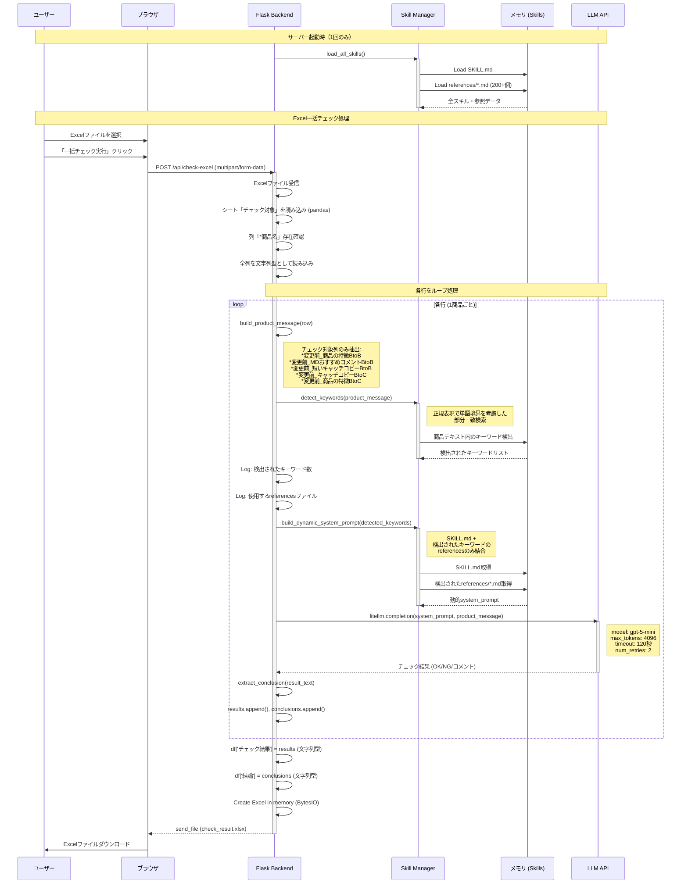

# システムシーケンス図

## Excel一括チェック処理フロー



## 主な処理ポイント

### 1. **サーバー起動時の初期化**
- 全SKILL.mdと200+個のreferences/*.mdをメモリに読み込み
- 以降、ファイルI/Oは発生しない

### 2. **動的キーワード検出**
- 商品テキストから正規表現で単語境界を考慮してキーワード検出
- 検出されたキーワードのreferencesのみをLLMに送信

### 3. **トークン最適化**
- **改善前**: 全references (200+個) × 行数
- **改善後**: 検出されたreferences (平均5-10個) × 行数
- **削減率**: 約95-98%

### 4. **データ型保持**
- 入力Excelの全列を文字列型として読み込み
- 出力列も明示的に文字列型で追加
- タスクIDの先頭0や日付フォーマットが保持される

### 5. **エラーハンドリング**
- LLM APIリトライ: 最大2回
- タイムアウト: 120秒/リクエスト
- 処理中断を防ぐため自動再起動を無効化 (use_reloader=False)

## ログ出力例

```
2026-01-26 14:30:15 - INFO - 📊 Excel一括チェック開始: 100行 (ファイル: products.xlsx)
2026-01-26 14:30:15 - INFO - 進捗: 1/100 行処理中...
2026-01-26 14:30:15 - INFO - 行 1: 検出されたキーワード数 = 3
2026-01-26 14:30:15 - INFO -   → 使用するreferencesファイル: 免疫, 効果, 美白
2026-01-26 14:30:25 - INFO - 行 2: 検出されたキーワード数 = 5
2026-01-26 14:30:25 - INFO -   → 使用するreferencesファイル: 薬, 治療, 改善, 効果, 機能性を
2026-01-26 14:30:35 - INFO - 行 3: キーワード検出なし（一般的なチェックのみ実施）
...
2026-01-26 14:45:00 - INFO - ✅ 処理完了: 100行
```
