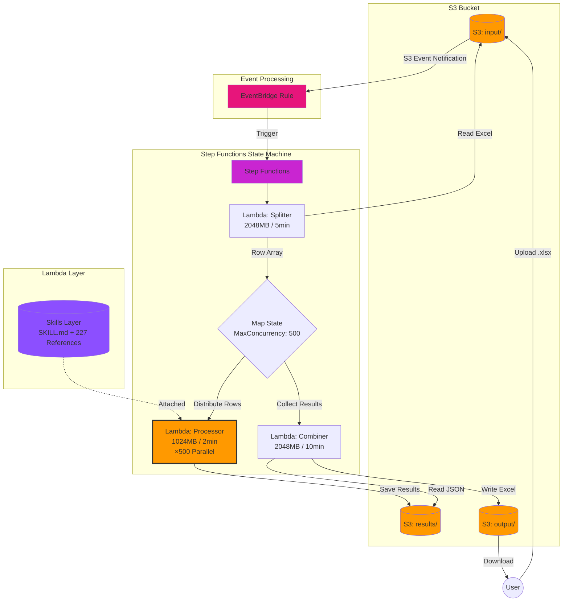

# Step Functions アーキテクチャ - Keywords Checker

## 概要

このディレクトリには、AWS Step FunctionsとLambdaを使用した大規模バッチ処理アーキテクチャの実装が含まれています。

## アーキテクチャ図

### AWSアーキテクチャ概要



### 推奨構成: EventBridge経由 ✅

```
S3 (input/)
  ↓ (EventBridge通知)
EventBridge Rule
  - S3イベント検知 (input/*.xlsx)
  - 入力トランスフォーマー
  ↓
Step Functions State Machine
  ↓
Lambda Splitter
  - Excelファイルを読み込み
  - 行データを配列に変換
  - execution_id発行
  ↓
Step Functions Map State
  - 最大500並列実行
  - 各行を個別に処理
  ↓
Lambda Processor ×500並列
  - キーワード検出
  - LLM API呼び出し（スタブモード）
  - 結果をS3に保存 (results/{execution_id}/{row_index}.json)
  ↓
Lambda Combiner
  - S3から全結果を収集
  - Excelファイルに統合
  - S3 (output/)にアップロード
```

### メリット

- ✅ **中間Lambda不要**: EventBridgeがStep Functionsを直接起動
- ✅ **イベント履歴**: EventBridgeコンソールで確認可能
- ✅ **柔軟なフィルタリング**: 複雑な条件設定が可能
- ✅ **複数ターゲット**: 同じイベントで複数の処理を起動可能
- ✅ **DLQ対応**: 失敗したイベントをDead Letter Queueに送信

## データフロー詳細

### S3経由のデータ受け渡し（10,000行対応）

Step Functionsの256KB制限を回避するため、大量の行データをS3経由で受け渡します。

### 1. Lambda Splitter

**入力:** S3イベント (input/sample.xlsx)

**処理:**
- Excelファイルを読み込み
- 各行を辞書形式に変換
- **各行データをS3に個別保存** (`results/{execution_id}/rows/row_{index}.json`)
- execution_idを生成（UUIDまたはタイムスタンプ）
- S3キーのリストを返す（行データ本体は含めない）

**出力:**
```json
{
  "execution_id": "20260204-143025-abc123",
  "input_bucket": "your-bucket",
  "input_key": "input/sample.xlsx",
  "output_bucket": "your-bucket",
  "output_key": "output/sample_checked.xlsx",
  "total_rows": 10000,
  "s3_row_keys": [
    {
      "row_index": 0,
      "s3_key": "results/20260204-143025-abc123/rows/row_0.json",
      "bucket": "your-bucket"
    },
    {
      "row_index": 1,
      "s3_key": "results/20260204-143025-abc123/rows/row_1.json",
      "bucket": "your-bucket"
    },
    ...
    // 10,000個のS3キー（各要素は数百バイト → 合計数MB以下）
  ]
}
```

### 2. Step Functions Map State

**処理:**
- `$.s3_row_keys` 配列を並列処理
- `MaxConcurrency: 500` で並列度制御
- 各アイテムに `execution_id`、`row_index`、`s3_key`、`bucket` を渡す

### 3. Lambda Processor

**入力:** Map Stateから1行分のS3キー情報
```json
{
  "execution_id": "20260204-143025-abc123",
  "row_index": 0,
  "s3_key": "results/20260204-143025-abc123/rows/row_0.json",
  "bucket": "your-bucket"
}
```

**処理:**
1. **S3から行データを読み込み** (`s3_key`を使用)
2. キーワード検出（200+キーワード）
3. LLM API呼び出し（**スタブモード**: タイムアウト90秒）
4. 結果をS3に保存: `s3://bucket/results/{execution_id}/{row_index}.json`

**出力:**
```json
{
  "row_index": 0,
  "status": "success",
  "s3_key": "results/20260204-143025-abc123/0.json"
}
```

**S3保存データ (results/{execution_id}/{row_index}.json):**
```json
{
  "row_index": 0,
  "変更後_キャッチコピーBtoC_チェック結果": "**結論**: OK\n...",
  "変更後_キャッチコピーBtoB_チェック結果": "**結論**: NG\n...",
  ...
}
```

### 4. Lambda Combiner

**入力:** Map Stateの全結果
```json
{
  "execution_id": "20260204-143025-abc123",
  "input_bucket": "your-bucket",
  "input_key": "input/sample.xlsx",
  "output_bucket": "your-bucket",
  "output_key": "output/sample_checked.xlsx",
  "total_rows": 10000,
  "results": [
    {"row_index": 0, "status": "success", "s3_key": "results/.../0.json"},
    {"row_index": 1, "status": "success", "s3_key": "results/.../1.json"},
    ...
    // 10,000個の結果
  ]
}
```

**処理:**
1. 元のExcelファイルをS3から読み込み
2. 各行の結果をS3から取得（`s3_key`を使用）
3. 結果列を追加してExcel作成
4. S3 output/にアップロード

**出力:** S3に保存されたExcelファイル

## Lambda関数の仕様

### Splitter

| 項目 | 値 |
|------|-----|
| ランタイム | Python 3.13 |
| メモリ | 2048 MB |
| タイムアウト | 5分 |
| 環境変数 | RESULTS_BUCKET (S3バケット名) |
| IAM権限 | S3 Read (input/) |
| トリガー | Step Functionsから呼び出し（EventBridge経由） |

### Processor

| 項目 | 値 |
|------|-----|
| ランタイム | Python 3.13 |
| メモリ | 1024 MB |
| タイムアウト | 2分 |
| 同時実行数 | 予約済み: 500 |
| 環境変数 | RESULTS_BUCKET, LITELLM_MODE=stub |
| IAM権限 | S3 Write (results/), Lambda Layer読み取り |
| Lambda Layer | keywords-checker-skills-layer |

### Combiner

| 項目 | 値 |
|------|-----|
| ランタイム | Python 3.13 |
| メモリ | 1024 MB |
| タイムアウト | 90秒（LLM API処理: 70秒 + マージン） |
| 予約済み同時実行数 | 500 |
| Lambda Layer | keywords-checker-skills-layer-sf (SKILL.md + 227 references) |
| 環境変数 | RESULTS_BUCKET, LITELLM_MODE=stub, LITELLM_API_BASE, LITELLM_MODEL, OPENAI_API_KEY |
| IAM権限 | S3 Read (results/), S3 Write (results/) |

### Lambda Combiner

## Step Functions仕様

| 項目 | 値 |
|------|-----|
| ステートマシン名 | keywords-checker-state-machine |
| タイムアウト | なし（最大1年） |
| 実行ロール | StepFunctionsExecutionRole |
| IAM権限 | Lambda Invoke (Splitter, Processor, Combiner) |

## ディレクトリ構造

```
step-functions/
├── README.md                    # このファイル
├── DEPLOY.md                    # デプロイ手順
├── EVENTBRIDGE_SETUP.md         # EventBridge設定ガイド
├── build.sh                     # ビルドスクリプト
├── state-machine.json           # Step Functions定義
├── skills/                      # SKILLファイルとreferencesファイル
│   └── 商品コピーチェック/
│       ├── SKILL.md             # チェックルール定義
│       └── references/          # キーワード別参照ファイル（200+）
│           ├── MRSA.md
│           ├── ウイルス.md
│           ├── ダイエット.md
│           └── ...
├── splitter/
│   ├── lambda_function.py       # Splitter Lambda関数
│   └── requirements.txt         # 依存関係: pandas, openpyxl, boto3
├── processor/
│   ├── lambda_function.py       # Processor Lambda関数（スタブモード）
│   └── requirements.txt         # 依存関係: litellm, tenacity
└── combiner/
    ├── lambda_function.py       # Combiner Lambda関数
    └── requirements.txt         # 依存関係: pandas, openpyxl, boto3
```

**注意:** このディレクトリは完全に独立しており、他のフォルダ（lambda/やbackend/）に依存しません。

## ビルド方法

```bash
cd step-functions
./build.sh
```

**生成物:**
- `build/skills-layer.zip` (約170KB) - SKILL.md + 200+ reference .md files
- `build/splitter.zip` (約43MB)
- `build/processor.zip` (約30MB)
- `build/combiner.zip` (約43MB)

## デプロイ方法

詳細は [DEPLOY.md](DEPLOY.md) を参照してください。

### デプロイの流れ

1. **Lambda関数を3つ作成** (Splitter, Processor, Combiner)
2. **Step Functions State Machineを作成** (state-machine.json)
3. **S3バケットでEventBridge通知を有効化**
4. **EventBridge Ruleを作成** (S3イベント → Step Functions)
5. **テスト実行** (S3にファイルアップロード)

## スタブモードについて

**Sandbox環境では内部LLM APIにアクセスできないため、スタブモードで動作します:**

- `processor/lambda_function.py` 内で `call_llm_api()` がモックレスポンスを返す
- 各チェック項目に対して以下の形式で結果を生成:

```
## 変更後_キャッチコピーBtoB
**結論**: NG
検出されたキーワード: ウイルス, 予防
（スタブ応答）対象箇所の確認が必要です。
```

## 処理時間の見積もり

### 10,000行の場合（本番運用想定）

| 項目 | 値 |
|------|-----|
| **データ行数** | 10,000行 |
| **LLM API処理時間** | 70秒/行（平均） |
| **並列処理数** | 500（MaxConcurrency） |
| **総バッチ数** | 10,000 ÷ 500 = 20バッチ |
| **Map State処理時間** | 20バッチ × 70秒 = 1,400秒（23.3分） |
| **Splitter処理時間** | 10-20秒（Excel読み込み + S3保存） |
| **Combiner処理時間** | 60-120秒（10,000結果読み込み + Excel生成） |
| **合計処理時間** | **約25-27分** |

### スケールアップ時の処理時間

| 行数 | 並列数 | バッチ数 | Map処理時間 | 合計時間 |
|------|--------|---------|------------|----------|
| 1,000行 | 500 | 2 | 140秒 | **約3分** |
| 5,000行 | 500 | 10 | 700秒 | **約13分** |
| 10,000行 | 500 | 20 | 1,400秒 | **約25分** |
| 20,000行 | 1,000 | 20 | 1,400秒 | **約25分**（並列数を1,000に増やす） |

**注意**: 並列数を500以上に増やす場合、Lambda予約済み同時実行数とMaxConcurrencyを両方増やす必要があります。

## Lambda→Lambda vs Step Functions
| 項目 | Lambda→Lambda | Step Functions |
|------|---------------|----------------|
| タイムアウト | 15分（Lambda1の制限） | 無制限（最大1年） |
| 並列度管理 | 手動（スロットリングリスク） | 自動（MaxConcurrency） |
| エラーハンドリング | 複雑 | 自動リトライ、部分再処理可能 |
| 進捗確認 | CloudWatch Logsのみ | Step Functionsコンソールで可視化 |
| データ保存 | Lambda1メモリ（制限あり） | S3（無制限） |
| コスト効率 | 待機時間もコスト発生 | 待機時間コストなし |
| 推奨規模 | <1,000行 | <100,000行 |

## コスト見積もり（月100回実行、10,000行処理）

- **Step Functions:** $0.025 × 10,000遷移 × 100回 = $25/月
- **Lambda Processor:** 1GB × 30秒 × 10,000行 × 100回 = $50/月
- [EventBridge + S3イベント通知](https://docs.aws.amazon.com/AmazonS3/latest/userguide/EventBridge.html)
- [EventBridge入力トランスフォーマー](https://docs.aws.amazon.com/eventbridge/latest/userguide/eb-transform-target-input.html)
- **Lambda Splitter:** 2GB × 10秒 × 100回 = $0.33/月
- **Lambda Combiner:** 2GB × 60秒 × 100回 = $2/月
- **S3ストレージ:** 10,000ファイル × 100回 × 5KB × $0.023/GB = $1.15/月
- **合計:** 約 **$78.48/月**

## 参考資料

- [AWS Step Functions Map State](https://docs.aws.amazon.com/step-functions/latest/dg/amazon-states-language-map-state.html)
- [Step Functions ペイロード制限](https://docs.aws.amazon.com/step-functions/latest/dg/limits-overview.html)
- [Lambda 同時実行数](https://docs.aws.amazon.com/lambda/latest/dg/lambda-concurrency.html)
